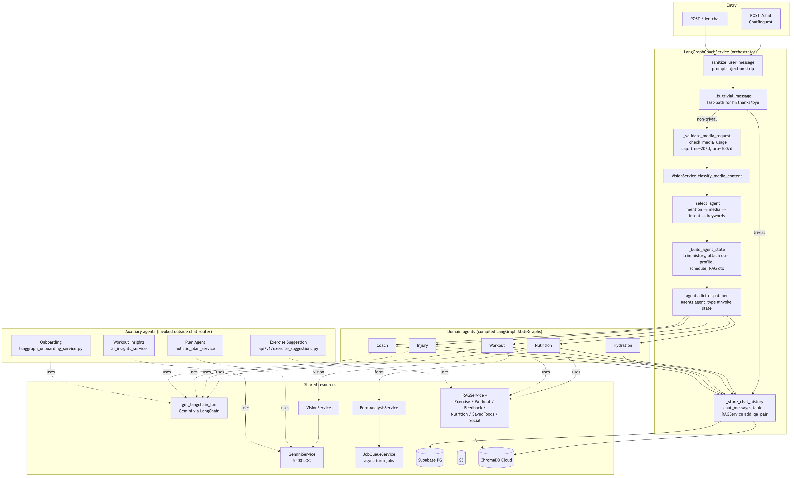
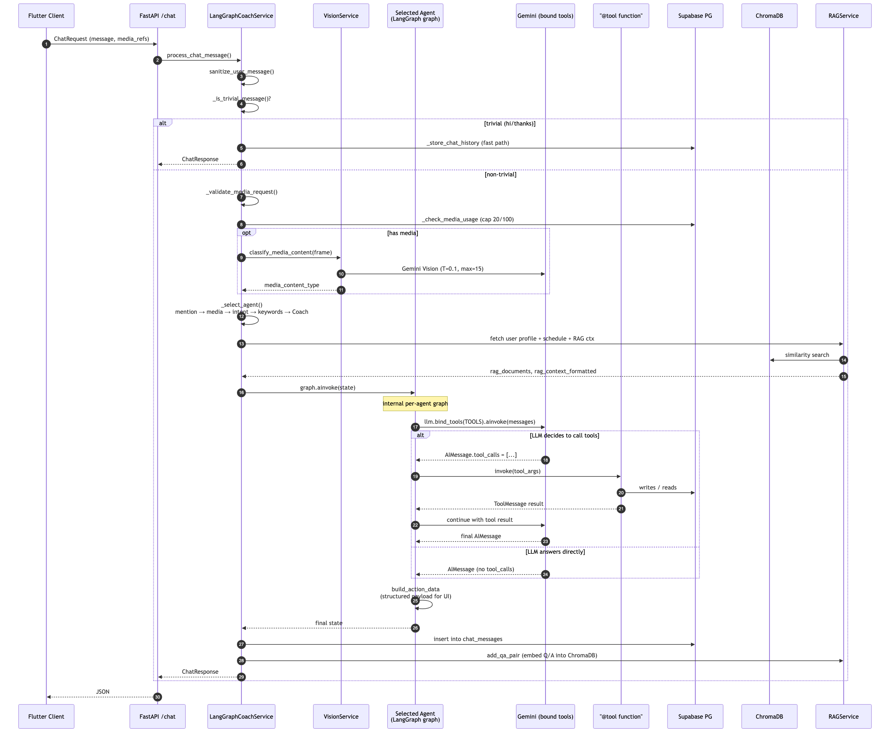
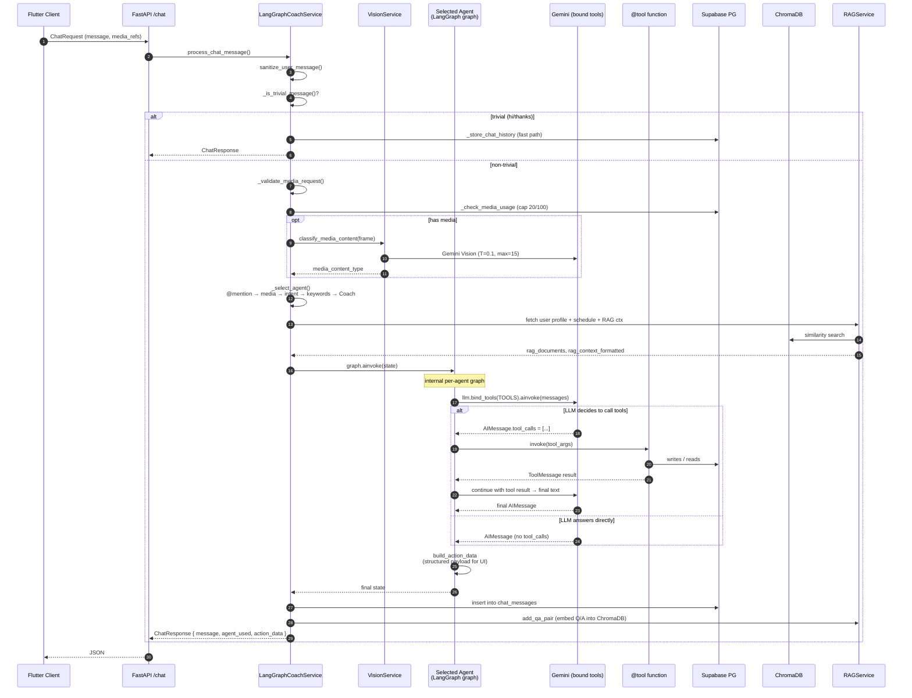
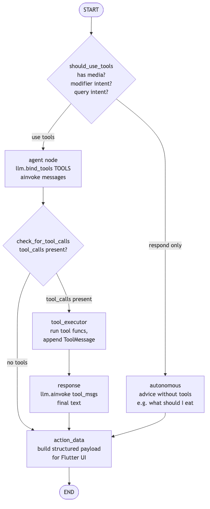
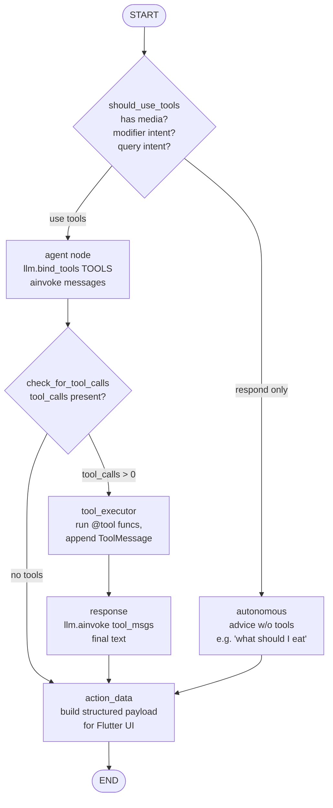
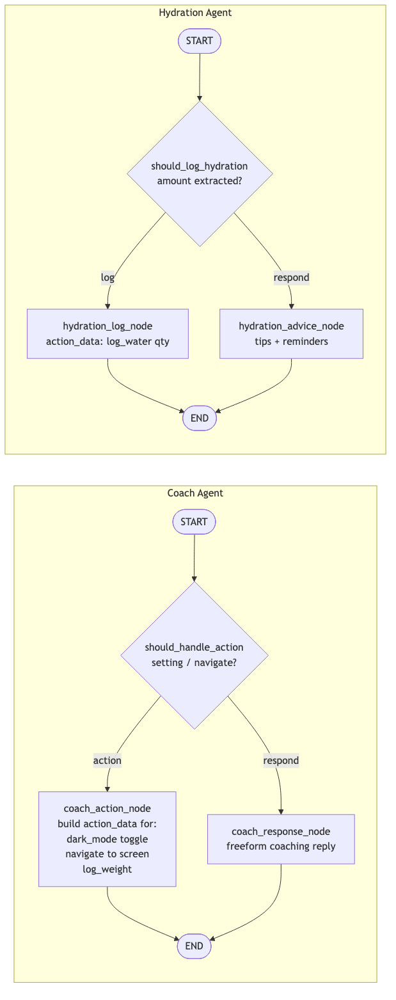
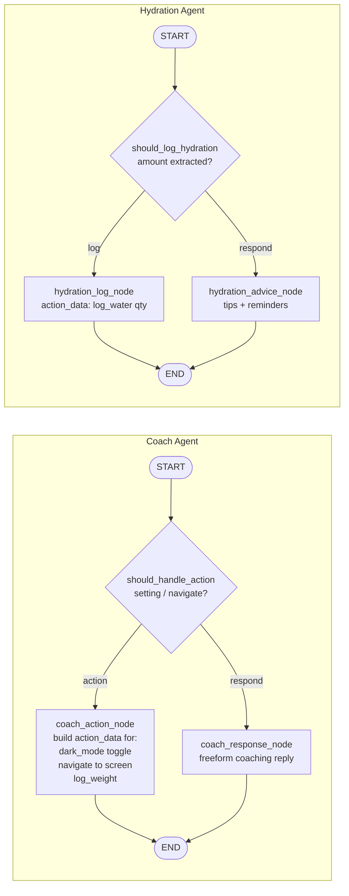
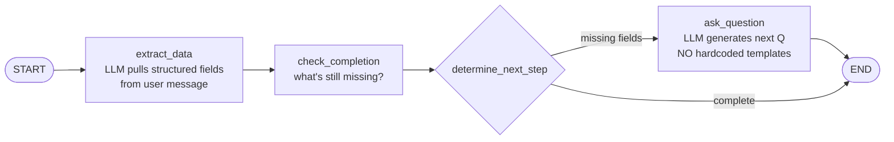
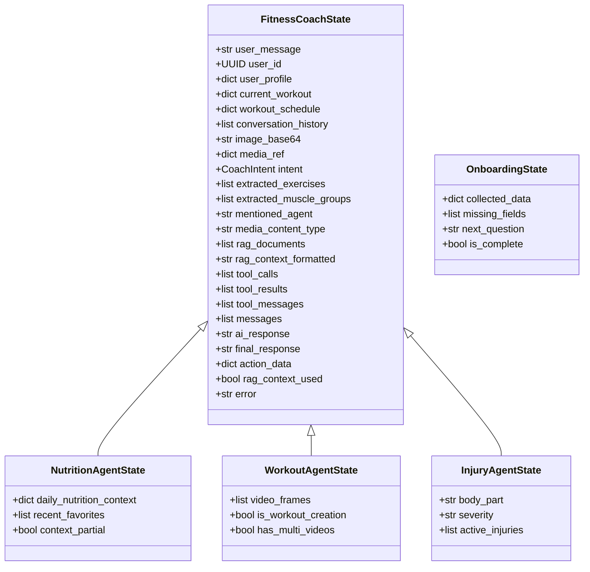
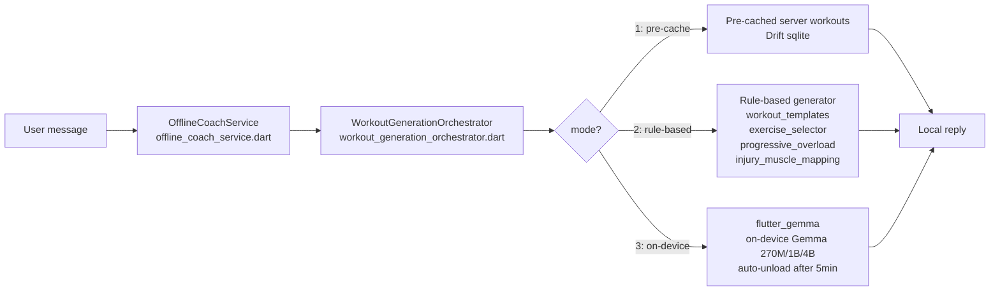

# Zealova — AI Agent Architecture

Deep dive into the LangGraph multi-agent system. Covers **topology**, **message lifecycle**, **per-agent graphs**, **state**, **tool registry**, and the **on-device agent**. See [`SYSTEM_ARCHITECTURE.md`](./SYSTEM_ARCHITECTURE.md) for the broader system view.

All diagrams live as `.mmd` in `docs/diagrams/` and as rendered PNGs alongside. Regenerate with `mmdc -i <file>.mmd -o <file>.png -b white -w 2800`.

---

## 1. Agent Topology



```mermaid
flowchart TB
  subgraph Entry["Entry"]
    CR[POST /chat<br/>ChatRequest]
    LC[POST /live-chat]
  end

  subgraph Orch["LangGraphCoachService (orchestrator)"]
    SAN[sanitize_user_message<br/>prompt-injection strip]
    TRIV[_is_trivial_message<br/>fast-path for hi/thanks/bye]
    MEDIA_VAL[_validate_media_request<br/>_check_media_usage<br/>cap: free=20/d, pro=100/d]
    CLASSIFY[VisionService.classify_media_content]
    SELECT[_select_agent<br/>@mention → media → intent → keywords]
    CTX[_build_agent_state<br/>trim history, attach user profile,<br/>schedule, RAG ctx]
    INVOKE[agents dict dispatcher<br/>agents agent_type .ainvoke state]
    STORE[_store_chat_history<br/>chat_messages table +<br/>RAGService.add_qa_pair]
  end

  subgraph Agents["Domain agents (compiled LangGraph StateGraphs)"]
    AN[Nutrition]
    AW[Workout]
    AI[Injury]
    AH[Hydration]
    AC[Coach]
  end

  subgraph AuxAgents["Auxiliary agents (invoked outside chat router)"]
    AONB[Onboarding<br/>langgraph_onboarding_service.py]
    AES[Exercise Suggestion<br/>api/v1/exercise_suggestions.py]
    APL[Plan Agent<br/>holistic_plan_service]
    AIN[Workout Insights<br/>ai_insights_service]
  end

  subgraph Shared["Shared resources"]
    LLM[get_langchain_llm<br/>Gemini via LangChain]
    GEMS[GeminiService<br/>5400 LOC]
    RAGS[RAGService +<br/>Exercise / Workout / Feedback /<br/>Nutrition / SavedFoods / Social]
    VIS[VisionService]
    FORM[FormAnalysisService]
    JQ[JobQueueService<br/>async form jobs]
    SB[(Supabase PG)]
    S3[(S3)]
    CHR[(ChromaDB Cloud)]
  end

  CR --> SAN --> TRIV
  LC --> SAN
  TRIV -- trivial --> STORE
  TRIV -- non-trivial --> MEDIA_VAL --> CLASSIFY --> SELECT --> CTX --> INVOKE
  INVOKE --> AN
  INVOKE --> AW
  INVOKE --> AI
  INVOKE --> AH
  INVOKE --> AC
  AN --> STORE
  AW --> STORE
  AI --> STORE
  AH --> STORE
  AC --> STORE
  STORE --> SB
  STORE --> CHR

  AN -.uses.-> LLM
  AW -.uses.-> LLM
  AI -.uses.-> LLM
  AC -.uses.-> LLM
  AN -.uses.-> RAGS
  AW -.uses.-> RAGS
  AN -.vision.-> VIS
  AW -.form.-> FORM
  FORM --> JQ
  VIS --> GEMS
  RAGS --> CHR
  AONB -.uses.-> LLM
  AES -.uses.-> RAGS
  APL -.uses.-> GEMS
  AIN -.uses.-> GEMS
```

### Orchestrator contract
- **Input**: `ChatRequest { user_id, message, conversation_id, media_refs?, image_base64?, ai_settings? }`
- **Output**: `ChatResponse { message, agent_used, action_data?, rag_context_used, similar_questions? }`
- **File**: `backend/services/langgraph_service.py`
- **Agents registry** (built at startup in `__init__`): 5 compiled LangGraph graphs live in memory for the process lifetime; auxiliary agents (onboarding, exercise suggestion, plan, insights) are built on-demand by their own service modules.

---

## 2. Message Lifecycle (end-to-end)





### Key properties
- **One agent per message**: no hand-off between agents mid-turn. If the user asks about both workout and nutrition, the orchestrator picks one; follow-up turns can route elsewhere.
- **Trivial fast-path**: greetings/thanks/byes skip classifier + RAG + agent graph entirely — saves the 5–13s ChromaDB Cloud cold-query tail.
- **Pre-agent media classification**: Gemini Vision decides the *content type* so the right agent gets routed even without an `@mention`. Cost ≈ $0.0001/call.
- **Action data contract**: every agent's final state includes `action_data` — a structured payload the Flutter client uses to trigger UI side-effects (log a food, open a workout, change a setting, jump to a screen) without parsing the natural-language reply.
- **No silent fallbacks**: if tool execution fails, the error surfaces in `state["error"]` and is returned to the client ([feedback_no_silent_fallbacks]).

---

## 3. Canonical Domain-Agent Graph

Nutrition, Workout, and Injury agents share the same shape. Only the tool belt differs.





### What makes the three agents different
| | Nutrition | Workout | Injury |
|---|---|---|---|
| Tools bound | `NUTRITION_TOOLS` (10) | `WORKOUT_TOOLS` / `WORKOUT_QUERY_TOOLS` + `form_tools` | `INJURY_TOOLS` (4) |
| Forces `tool_choice`? | No | **Yes** — `check_exercise_form` if 1 video, `compare_exercise_form` if >1, `generate_quick_workout` on creation intent | No |
| Vision involvement | Food image → `analyze_food_image`; screenshots → `parse_app_screenshot` | Form video → keyframes → `check_exercise_form` | N/A |
| Side-effect triggers | food_log INSERT, macros update, XP | workouts table mutate, **invalidate_upcoming_workouts** | injuries INSERT, **invalidate_upcoming_workouts** |
| Retry path | Thought-signature error → re-bind without `tool_choice`, retry once | Same | Same |

### The tool-calling loop in detail
1. `agent_node` constructs messages: `[SystemMessage(personality + role), *history, HumanMessage(user_msg)]` plus RAG context inlined.
2. `llm = get_langchain_llm(temperature=0.7).bind_tools(TOOLS)`.
3. `response = await llm.ainvoke(messages)` — Gemini decides whether `tool_calls` is present.
4. If tools: `tool_executor_node` runs each tool (sync or async via `run_async_in_sync` with 30s timeout), appends `ToolMessage(tool_call_id=..., content=result)`.
5. `response_node` re-invokes the LLM with the appended tool messages to get a natural-language wrap-up.
6. `action_data_node` projects tool results into the Flutter-facing payload.

---

## 4. Simple Agent Variants

Coach and Hydration agents are simpler — no bound tools, just a route → node → END pattern. These handle cases where the side-effect is driven by `action_data` alone (e.g. toggling dark mode, logging water) rather than a DB-touching tool.





### Onboarding agent (special — non-chat)
Not invoked by the chat router. Owned by `services/langgraph_onboarding_service.py`.



**Loop semantics**: each user turn starts from START and walks through extract → check → ask_question → END. The *next* user message starts a fresh graph run with accumulated state.

---

## 5. Agent State & Tool Registry

### State schemas
Each agent has its own `TypedDict` state, but they share a common backbone (defined in `langgraph_agents/state.py` — `FitnessCoachState`). Per-agent states add domain fields (e.g. `NutritionAgentState` adds `daily_nutrition_context`, `recent_favorites`; `WorkoutAgentState` adds `media_ref`, `video_frames`).



### Tool registry (full inventory)

| File | Tools | Agents that bind them |
|------|-------|------------------------|
| `tools/nutrition_tools.py` | `analyze_food_image`, `analyze_multi_food_images`, `parse_app_screenshot`, `parse_nutrition_label`, `log_food_from_text`, `get_nutrition_summary`, `get_recent_meals`, `get_calorie_remainder`, `get_favorite_foods`, `get_todays_workout_for_meal` | Nutrition |
| `tools/workout_tools.py` | `add_exercise_to_workout`, `remove_exercise_from_workout`, `replace_all_exercises`, `modify_workout_intensity`, `reschedule_workout`, `delete_workout`, `generate_quick_workout` | Workout |
| `tools/form_tools.py` | `check_exercise_form`, `compare_exercise_form` | Workout |
| `tools/injury_tools.py` | `report_injury`, `clear_injury`, `get_active_injuries`, `update_injury_status` | Injury |
| `tools/nutrition_context_helpers.py` | `fetch_daily_nutrition_context`, `fetch_recent_favorites`, `fetch_todays_workout` (plain helpers, not `@tool`) | Called from `_build_agent_state` before agent runs |

### Cost-protection guards on the orchestrator
- `MAX_MEDIA_PER_REQUEST = 5`, `MAX_IMAGES_PER_REQUEST = 5`, `MAX_VIDEOS_PER_REQUEST = 3`
- `DAILY_MEDIA_CAP_FREE = 20`, `DAILY_MEDIA_CAP_PRO = 100` (tracked in `chat_media_usage` table)
- `_NUTRITION_SEMAPHORE = asyncio.Semaphore(10)` — caps concurrent vision calls backend-wide
- `_trim_conversation_history(max_total_chars=50_000)` — drops oldest turns before LLM call
- `sanitize_user_message` strips known prompt-injection patterns (9 regexes — ignore/disregard/forget previous instructions, fake `SYSTEM:` / `ASSISTANT:` roles, token-boundary markers like `<|im_start|>`)

---

## 6. On-Device Agent (Offline)

When the device is offline, the chat UI switches to an on-device loop.



**Strict mode boundaries** (per [feedback_no_silent_fallbacks]): once a mode is selected it is NOT allowed to silently fall back to another mode — the user must explicitly switch in Settings → Offline Mode. `device_capability_service` picks the Gemma size (270M on low-end, 1B mid, 4B on high-end Android/iOS).

---

## 7. Where this lives in the repo

| Concern | File |
|---|---|
| Orchestrator | `backend/services/langgraph_service.py` |
| Root chat graph (legacy, still used for ALL_TOOLS binding) | `backend/services/langgraph_agents/graph.py` |
| Common state | `backend/services/langgraph_agents/state.py` |
| Common nodes (intent, RAG, tool exec, storage) | `backend/services/langgraph_agents/nodes.py` |
| Personality prompts | `backend/services/langgraph_agents/personality.py` |
| Tools | `backend/services/langgraph_agents/tools/*.py` |
| Domain agents | `backend/services/langgraph_agents/{nutrition,workout,injury,hydration,coach}_agent/{graph,nodes,state}.py` |
| Onboarding agent | `backend/services/langgraph_agents/onboarding/` + `services/langgraph_onboarding_service.py` |
| Media classifier | `backend/services/vision_service.py` |
| LangChain/Gemini client | `backend/core/gemini_client.py` |
| Chat endpoint | `backend/api/v1/chat.py` |
| Live chat (SSE) | `backend/api/v1/live_chat.py` |
| Offline agent | `mobile/flutter/lib/services/offline_coach_service.dart` |
| Offline orchestrator | `mobile/flutter/lib/services/workout_generation_orchestrator.dart` |
| On-device LLM | `mobile/flutter/lib/services/on_device_gemma_service.dart` |
