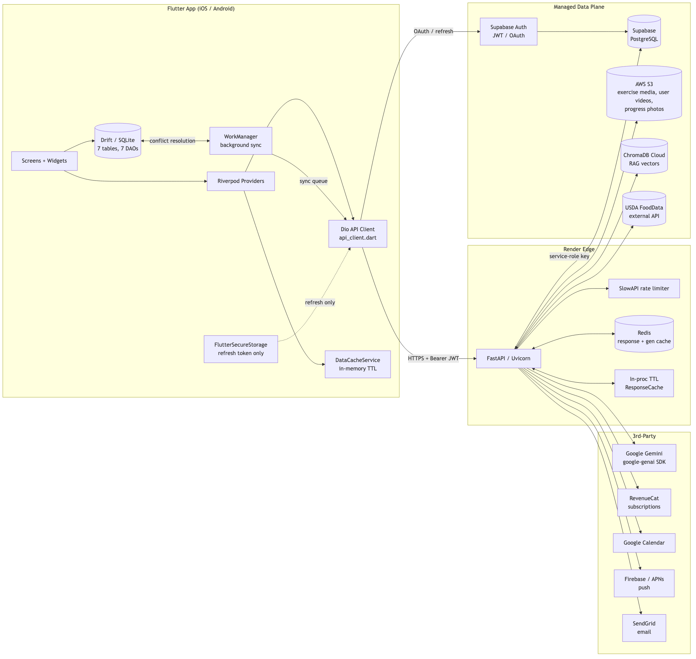
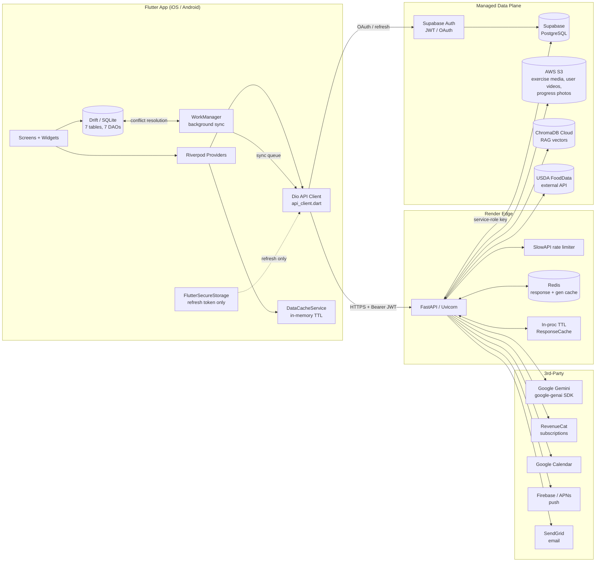
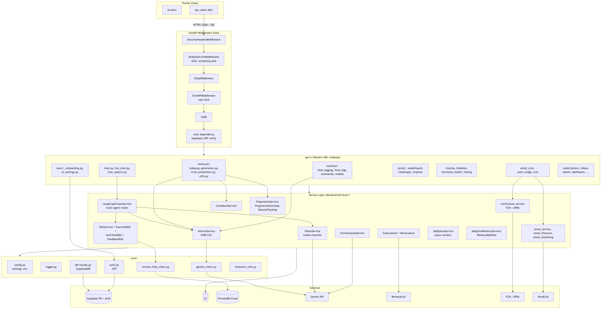
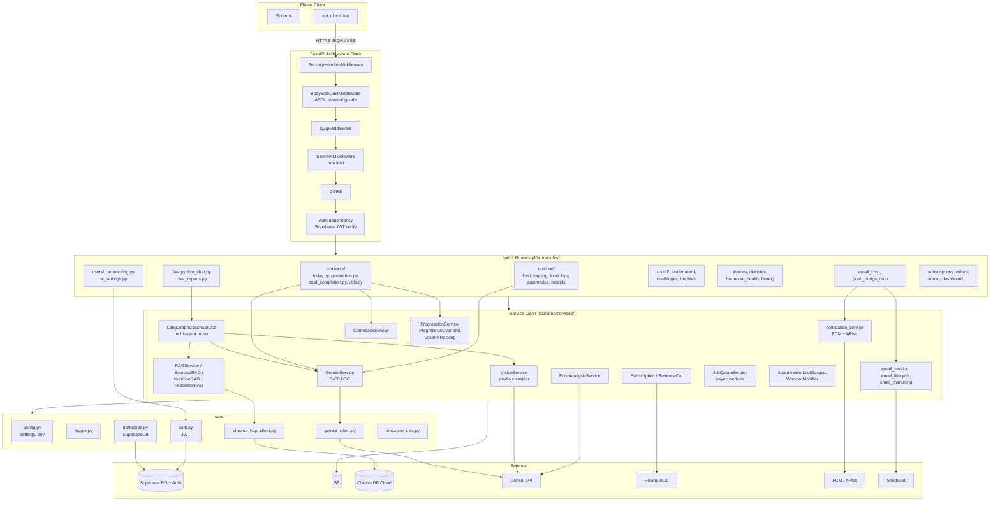
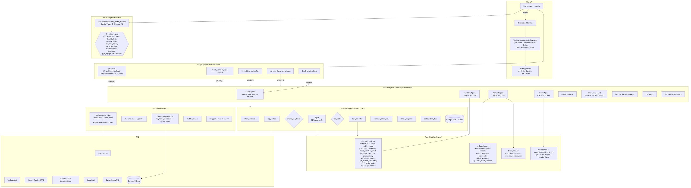
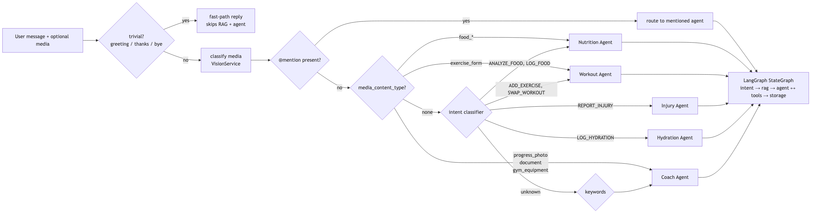

# Zealova — System Architecture

Three views of the system: **Data Architecture**, **Backend Architecture**, **AI Architecture**. Each section starts with a Mermaid diagram (GitHub/Obsidian/VS Code render it inline) followed by a written walkthrough. Standalone `.mmd` sources live in `docs/diagrams/` and can be rendered to images with:

```bash
npx -y @mermaid-js/mermaid-cli -i docs/diagrams/data_architecture.mmd -o docs/diagrams/data_architecture.png -b transparent -w 2400
# repeat for backend_architecture.mmd, ai_architecture.mmd, agent_routing.mmd
```

---

## 1. Data Architecture





### Storage tiers
| Tier | Store | Purpose | Lifetime |
|------|-------|---------|----------|
| L0 — device RAM | `DataCacheService`, Riverpod state | Instant re-render | Session |
| L1 — device disk | **Drift (SQLite)** — workouts, logs, sync queue | Offline mode | Persistent, conflict-resolved on sync |
| L1.5 — secrets | FlutterSecureStorage | Supabase **refresh** token only (live access token always read from `Supabase.instance.client.auth.currentSession` per [feedback_verify_before_deploy] pattern) | Persistent |
| L2 — backend RAM | `ResponseCache` TTL dicts | Hot user context, gen dedup | Per-instance |
| L2.5 — Redis | `core/redis_cache.py` | Cross-request cache, rate limiting | TTL-bound |
| L3 — Postgres | **Supabase** | Source of truth: users, workouts, food_logs, injuries, xp, trophies, subscriptions, … | Durable, RLS-enforced |
| L3 — object | **S3** | Exercise illustrations (`ILLUSTRATIONS ALL/` — note: plain `ILLUSTRATIONS/` does NOT exist, several scripts still reference the wrong prefix), form videos, progress photos | Durable |
| L3 — vector | **ChromaDB Cloud** | Exercise/workout/feedback/nutrition embeddings for RAG | Durable, re-indexable |

### Data-flow highlights
- **Writes**: Flutter → FastAPI → Supabase. Non-critical writes use `BackgroundTasks`. Nutrition + XP + trophies update in parallel via `asyncio.gather()`.
- **Offline writes**: Drift first → queued in `sync_queue` table → `workmanager` + `connectivity_plus` (1.5s debounce) drains queue when online. Conflict resolution: **client-wins for logs, server-wins for workouts**.
- **Reads**: Cache-first (L0 → L2.5 → L3) with exponential-backoff polling for in-flight generation (2s → 4s → 8s → 16s → 30s, max 30 polls).
- **Media pipeline**: Client uploads to S3 via signed URL → backend stores S3 key in Postgres → `VisionService` pulls frame/image → Gemini classifies → downstream agent consumes.
- **RAG indexing**: Exercise library + user workout history + feedback + nutrition docs embedded into ChromaDB Cloud; queried at chat time by `rag_context_node`.

---

## 2. Backend Architecture





### Backend patterns in use
- **3-phase startup** (`main.py` lifespan): fast critical init → background warmup → lazy service instantiation. Mitigates Render free-tier cold starts (10–30s).
- **Parallel DB**: `asyncio.gather()` + `ThreadPoolExecutor(max_workers=15)` for independent Supabase queries (see `workouts/today.py` — 3 parallel reads).
- **Background tasks**: `BackgroundTasks` for XP, trophies, email, cache writes — never block the response.
- **Streaming**: `POST /workouts/generate-stream` returns SSE (`chunk`/`done`/`error`/`already_generating`). First chunk < 500ms.
- **3-layer dedup** for workout generation: placeholder row (`status='generating'`) + in-proc `_active_background_generations` set + existence check.
- **Invalidation cascades**: injury / avoidance / muscle-avoidance / queued-exercise events delete upcoming workouts via `invalidate_upcoming_workouts()`; next `/today` triggers regeneration.
- **Rate limiting**: SlowAPI, per-endpoint (e.g. `generate-stream` = 15/min/user).
- **Auth**: Every request re-validates the live Supabase session token; refresh tokens proactively refreshed on the client with a timer.
- **Email/push cron**: Hourly workers in `email_cron.py` + `push_nudge_cron.py` branch on user-local time (morning/midday/evening/quiet) using device IANA zone (per [feedback_user_local_time_only]).

---

## 3. AI Architecture

```mermaid
flowchart TB
  subgraph ClientAI["Client AI"]
    UM[User message + media]
    OCS[OfflineCoachService]
    OGEMMA[flutter_gemma<br/>on-device Gemma 270M/1B/4B]
    OORCH[WorkoutGenerationOrchestrator<br/>pre-cache / rule-based / on-device<br/>NO cross-mode fallback]
  end

  subgraph Classify["Pre-routing Classification"]
    VIS[VisionService.classify_media_content<br/>Gemini Vision, T=0.1, max=15]
    CLS{{10 content types:<br/>food_plate, food_menu, food_buffet,<br/>exercise_form, progress_photo,<br/>app_screenshot, nutrition_label,<br/>document, gym_equipment, unknown}}
  end

  subgraph Router["LangGraphCoachService Router"]
    MENTION["@mention (@nutrition/@workout/<br/>@injury/@hydration/@coach)"]
    MEDIA[media_content_type fallback]
    INTENT[Gemini intent classifier]
    KW[keyword dictionary fallback]
    DEFAULT[Coach agent default]
  end

  subgraph Agents["Domain Agents (LangGraph StateGraphs)"]
    AG_Coach[Coach Agent<br/>general Q&A, app nav, settings]
    AG_Nut[Nutrition Agent<br/>10 @tool functions]
    AG_Work[Workout Agent<br/>7 @tool functions]
    AG_Inj[Injury Agent<br/>4 @tool functions]
    AG_Hyd[Hydration Agent]
    AG_Onb[Onboarding Agent<br/>AI-driven, no hardcoded Q]
    AG_ExSug[Exercise Suggestion Agent]
    AG_Plan[Plan Agent]
    AG_Insights[Workout Insights Agent]
  end

  subgraph GraphNodes["Per-agent graph (example: Coach)"]
    N1[intent_extractor]
    N2[rag_context]
    N3{should_use_tools?}
    N4[agent<br/>LLM.bind_tools]
    N5{tool_calls?}
    N6[tool_executor]
    N7[response_after_tools]
    N8[simple_response]
    N9[build_action_data]
    N10[(storage: chat + vectors)]
  end

  subgraph Tools["Tool Belt (@tool funcs)"]
    T_NUT[nutrition_tools.py<br/>analyze_food_image, multi_images,<br/>parse_app_screenshot, parse_nutrition_label,<br/>log_food_from_text, get_summary,<br/>get_recent_meals, get_calorie_remainder,<br/>get_favorite_foods, get_todays_workout]
    T_WK[workout_tools.py<br/>add/remove/replace exercise,<br/>modify_intensity, reschedule,<br/>delete_workout, generate_quick_workout]
    T_INJ[injury_tools.py<br/>report_injury, clear_injury,<br/>get_active_injuries, update_status]
    T_FORM[form_tools.py<br/>check_exercise_form,<br/>compare_exercise_form]
  end

  subgraph Gen["Non-chat AI surfaces"]
    WGEN[Workout Generation<br/>GeminiService + Comeback +<br/>ProgressiveOverload + RAG]
    HABIT[Habit / Recipe suggestion]
    FORM[Form analysis pipeline<br/>keyframe_extractor → Gemini Vision]
    HASH[Hashtag service]
    WRAP[Wrapped / year-in-review]
  end

  subgraph RAGSys["RAG"]
    RAG_EX[ExerciseRAG]
    RAG_WK[WorkoutRAG]
    RAG_FB[WorkoutFeedbackRAG]
    RAG_NUT[NutritionRAG + SavedFoodsRAG]
    RAG_SOC[SocialRAG]
    RAG_CIN[CustomInputsRAG]
    CHROMA2[(ChromaDB Cloud)]
  end

  UM --> VIS --> CLS --> Router
  UM --> Router
  MENTION -->|priority 1| Agents
  MEDIA -->|priority 2| Agents
  INTENT -->|priority 3| Agents
  KW -->|priority 4| Agents
  DEFAULT -->|fallback| AG_Coach

  AG_Coach --> GraphNodes
  AG_Nut --> T_NUT
  AG_Work --> T_WK
  AG_Work --> T_FORM
  AG_Inj --> T_INJ

  N2 --> RAGSys
  RAGSys --> CHROMA2
  N4 --> Tools
  N6 --> Tools

  WGEN --> RAGSys
  FORM --> CHROMA2

  UM -.offline.-> OCS
  OCS --> OORCH
  OORCH --> OGEMMA
```





### AI subsystem inventory

**Primary model**: `gemini-3-flash-preview` via `google-genai` + `langchain-google-genai`. Client in `core/gemini_client.py`; wrapper service `services/gemini_service.py` (~5400 LOC) handles prompt building, robust JSON parsing (strips markdown fences), safety-filter retries, and streaming.

**LLM surfaces**:
1. **LangGraph chat agents** (9 specialized graphs — see §4).
2. **Workout generation** — `services/gemini_service.py` + `api/v1/workouts/generation.py` (streaming + non-streaming).
3. **Media classification** — `VisionService.classify_media_content()` (cheap: T=0.1, max_output_tokens=15, ~$0.0001/call).
4. **Form analysis** — `FormAnalysisService` → keyframe extraction → Gemini Vision scoring.
5. **Onboarding** — AI-driven question generation (no hardcoded templates).
6. **Content generators** — habit suggestions, recipe suggestions, hashtags, wrapped stories, insights.
7. **On-device AI** — `flutter_gemma` running Gemma 270M/1B/4B with auto-unload after 5 min idle; auto-picks size from `device_capability_service`.

**RAG stack** (all backed by ChromaDB Cloud):
- `ExerciseRAG` — exercise library semantic search (for workout gen + modifications).
- `WorkoutRAG` — user's past workouts (personalized recall).
- `WorkoutFeedbackRAG` — RPE/notes/completion signals.
- `NutritionRAG` + `SavedFoodsRAG` — food DB + user's custom/saved foods.
- `SocialRAG`, `CustomInputsRAG` — hashtags, user-defined vocab.

**Guardrails**:
- Safety filters (HARM_CATEGORY_*) configured to allow fitness content that would otherwise be blocked.
- Robust JSON extraction (handles ```json fences, leading/trailing prose).
- Thought-signature retry: if LangChain complains about Gemini thought signatures, re-bind tools without `tool_choice` and retry once.
- No silent fallbacks on generation failures — errors surface to the client ([feedback_no_silent_fallbacks]).

---

## 4. Where Are We Using Agents?

The word "agent" shows up in several distinct places in this codebase. Here's the full inventory:

### 4.1 LangGraph multi-agent chat (the main one)
Location: `backend/services/langgraph_agents/` + `backend/services/langgraph_service.py`

Every chat message flows through `LangGraphCoachService`, which **routes to exactly one specialized agent** per message. Each agent is its own `StateGraph` (LangGraph) with bound tools.

| Agent | Folder | Bound tools | Responsibility |
|-------|--------|-------------|----------------|
| **Coach** | `coach_agent/` | (none — Q&A only, `ALL_TOOLS` in legacy root graph) | Default agent. General fitness Q&A, app navigation, settings, weight logging, water-goal setting. |
| **Nutrition** | `nutrition_agent/` | `NUTRITION_TOOLS` (10) | Food image analysis, multi-image (buffet/menu), app-screenshot OCR, nutrition label parsing, text food logging, summaries, recent meals, calorie remainder, favorites, today's-workout-for-meal lookup. |
| **Workout** | `workout_agent/` | `WORKOUT_TOOLS` / `WORKOUT_QUERY_TOOLS` (7) + `form_tools` (2) | Add/remove/replace/modify/reschedule/delete exercises, generate quick workouts, form check (single video), form compare (multi-video). Uses `tool_choice=` to force specific tools when media is attached. |
| **Injury** | `injury_agent/` | `INJURY_TOOLS` (4) | Report injury, clear injury, list active injuries, update status. Triggers workout invalidation. |
| **Hydration** | `hydration_agent/` | (small set) | Log water intake, hydration tips. |
| **Onboarding** | `onboarding/` | N/A — special graph | AI-driven onboarding: `extract_data` → `check_completion` → `ask_question`. Decides the next question dynamically based on what's still missing. |
| **Exercise Suggestion** | `exercise_suggestion/` | (none) | Standalone graph for suggesting exercises when the user's workout is missing one. |
| **Plan** | `plan_agent/` | (none) | Holistic plan generation / updates. |
| **Workout Insights** | `workout_insights/` | (none) | Post-workout insight generation (called from `ai_insights_service`). |

**Routing priority** (implemented in `langgraph_service._select_agent()`):
1. `@mention` in message (`@nutrition`, `@workout`, `@injury`, `@hydration`, `@coach`) — **highest priority**.
2. `media_content_type` from `VisionService.classify_media_content()` — e.g. `food_plate` → Nutrition, `exercise_form` → Workout, `progress_photo` → Coach.
3. Type-based fallback for media without classifier (video → Workout, image → Nutrition).
4. Gemini-inferred `intent` (`ANALYZE_FOOD` → Nutrition, `ADD_EXERCISE` → Workout, `REPORT_INJURY` → Injury, …).
5. Keyword dictionary (`DOMAIN_KEYWORDS` per agent).
6. **Coach agent** as default.



```mermaid
flowchart LR
  M[User message + optional media]
  M --> T{trivial?<br/>greeting / thanks / bye}
  T -->|yes| FAST[fast-path reply<br/>skips RAG + agent]
  T -->|no| CLS[classify media<br/>VisionService]
  CLS --> P1{@mention?}
  P1 -->|yes| ROUTE[route to mentioned agent]
  P1 -->|no| P2{media_content_type?}
  P2 -->|food_*| NUT
  P2 -->|exercise_form| WK
  P2 -->|progress_photo<br/>document<br/>gym_equipment| CCH
  P2 -->|none| P3{intent classifier}
  P3 -->|ANALYZE_FOOD,<br/>LOG_FOOD, …| NUT
  P3 -->|ADD_EXERCISE,<br/>SWAP_WORKOUT, …| WK
  P3 -->|REPORT_INJURY| INJ
  P3 -->|LOG_HYDRATION| HYD
  P3 -->|unknown| KW{keywords}
  KW --> CCH[Coach Agent]
  NUT[Nutrition Agent]
  WK[Workout Agent]
  INJ[Injury Agent]
  HYD[Hydration Agent]
  ROUTE --> AGENTS
  NUT --> AGENTS[LangGraph StateGraph<br/>intent → rag → agent ↔ tools → storage]
  WK --> AGENTS
  INJ --> AGENTS
  HYD --> AGENTS
  CCH --> AGENTS
```

### 4.2 Offline "agent" on-device
`mobile/flutter/lib/services/offline_coach_service.dart` + `on_device_gemma_service.dart` run a **local** agent-ish loop for chat when the device is offline. Gemma does the text; the orchestrator decides between cached / rule-based / on-device modes with strict boundaries (no silent fallback between modes).

### 4.3 "Agent swarm" in development (not runtime)
Per `CLAUDE.md` / `MEMORY.md`, "agent swarm" refers to **Claude Code subagents** used during development to parallelize tasks with exclusive file ownership — it is *not* a runtime system. Don't confuse this with the LangGraph agents above.

### 4.4 What is NOT an agent (despite the name)
- `services/*_service.py` — deterministic services (e.g. `ComebackService`, `ProgressionService`) — plain Python classes, no LLM loop.
- `adaptive_workout_service.py`, `workout_modifier.py` — rule-based post-processing, not agents.
- Cron workers (`email_cron.py`, `push_nudge_cron.py`) — scheduled jobs, not agents.

---

## Appendix — File pointers

| Concern | File |
|---------|------|
| API client | `mobile/flutter/lib/data/services/api_client.dart` |
| API constants | `mobile/flutter/lib/core/constants/api_constants.dart` |
| Today workout provider | `mobile/flutter/lib/data/providers/today_workout_provider.dart` |
| Offline orchestrator | `mobile/flutter/lib/services/workout_generation_orchestrator.dart` |
| Backend entry | `backend/main.py` |
| Multi-agent router | `backend/services/langgraph_service.py` |
| Root chat graph | `backend/services/langgraph_agents/graph.py` |
| Per-agent graphs | `backend/services/langgraph_agents/{coach,nutrition,workout,injury,hydration,onboarding}_agent/graph.py` |
| Tool belts | `backend/services/langgraph_agents/tools/{nutrition,workout,injury,form}_tools.py` |
| Gemini wrapper | `backend/services/gemini_service.py` (~5400 LOC) |
| Media classifier | `backend/services/vision_service.py` |
| Workout generation | `backend/api/v1/workouts/{today,generation,utils}.py` |
| Supabase facade | `backend/core/db/facade.py` |

For the deeper workout-generation lifecycle (pre-caching, invalidation, comeback mode, injury flow), see [`ARCITECTURE.md`](./ARCITECTURE.md).
