# AI Fitness Coach - Multi-Agent Architecture

## Overview

The AI Fitness Coach uses a **multi-agent architecture** where specialized domain agents handle different aspects of fitness coaching. Each agent can both **use tools** (database operations) and **reason autonomously** (answer questions without tools).

## High-Level Architecture

```mermaid
flowchart TB
    subgraph Frontend["📱 Flutter App"]
        UI[Chat Interface]
    end

    subgraph Backend["🖥️ FastAPI Backend"]
        API["/api/v1/chat/send"]
        Router[("🔀 Router<br/>LangGraphCoachService")]
    end

    subgraph Agents["🤖 Domain Agents"]
        direction TB
        NA["🥗 Nutrition Agent<br/><i>Nutri</i>"]
        WA["💪 Workout Agent<br/><i>Flex</i>"]
        IA["🏥 Injury Agent<br/><i>Recovery</i>"]
        HA["💧 Hydration Agent<br/><i>Aqua</i>"]
        CA["🏋️ Coach Agent<br/><i>Coach</i>"]
    end

    subgraph Tools["🔧 Tools"]
        NT["analyze_food_image<br/>get_nutrition_summary<br/>get_recent_meals"]
        WT["add_exercise<br/>remove_exercise<br/>replace_all_exercises<br/>modify_intensity<br/>reschedule<br/>delete_workout"]
        IT["report_injury<br/>clear_injury<br/>get_active_injuries<br/>update_injury_status"]
    end

    subgraph DB["💾 Database"]
        Supabase[(Supabase)]
    end

    UI --> API
    API --> Router

    Router --> NA
    Router --> WA
    Router --> IA
    Router --> HA
    Router --> CA

    NA --> NT
    WA --> WT
    IA --> IT

    NT --> Supabase
    WT --> Supabase
    IT --> Supabase

    style Router fill:#f9f,stroke:#333,stroke-width:2px
    style NA fill:#90EE90,stroke:#333
    style WA fill:#87CEEB,stroke:#333
    style IA fill:#FFB6C1,stroke:#333
    style HA fill:#ADD8E6,stroke:#333
    style CA fill:#DDA0DD,stroke:#333
```



## Routing Flow

```mermaid
flowchart TD
    Start([User Message]) --> Mention{@mention?}

    Mention -->|"@nutrition"| NA[Nutrition Agent]
    Mention -->|"@workout"| WA[Workout Agent]
    Mention -->|"@injury"| IA[Injury Agent]
    Mention -->|"@hydration"| HA[Hydration Agent]
    Mention -->|"@coach"| CA[Coach Agent]
    Mention -->|No| Image{Has Image?}

    Image -->|Yes| NA
    Image -->|No| Intent{Check Intent}

    Intent -->|ANALYZE_FOOD| NA
    Intent -->|ADD_EXERCISE| WA
    Intent -->|REPORT_INJURY| IA
    Intent -->|LOG_HYDRATION| HA
    Intent -->|QUESTION| Keywords{Check Keywords}

    Keywords -->|"food, calories"| NA
    Keywords -->|"exercise, workout"| WA
    Keywords -->|"pain, injury"| IA
    Keywords -->|"water, hydration"| HA
    Keywords -->|Default| CA

    NA --> Response([Response])
    WA --> Response
    IA --> Response
    HA --> Response
    CA --> Response

    style Start fill:#f9f,stroke:#333
    style Response fill:#9f9,stroke:#333
```

## Individual Agent Flows

### Nutrition Agent


### Workout Agent

```mermaid
flowchart LR
    subgraph WorkoutAgent["💪 Workout Agent"]
        direction TB
        W_Start([START]) --> W_Router{Modification<br/>Request?}

        W_Router -->|Yes| W_Tools["Agent with Tools<br/>• add_exercise<br/>• remove_exercise<br/>• replace_all_exercises<br/>• modify_intensity<br/>• reschedule<br/>• delete_workout"]
        W_Router -->|No| W_Auto["Autonomous Response<br/>• Form advice<br/>• Training tips<br/>• Exercise guidance"]

        W_Tools --> W_Check{Tools Called?}
        W_Check -->|Yes| W_Exec[Execute Tools] --> W_Response[Generate Response]
        W_Check -->|No| W_Action[Build Action Data]

        W_Auto --> W_Action
        W_Response --> W_Action
        W_Action --> W_End([END])
    end

    style W_Start fill:#87CEEB
    style W_End fill:#87CEEB
```



### Injury Agent

```mermaid
flowchart LR
    subgraph InjuryAgent["🏥 Injury Agent"]
        direction TB
        I_Start([START]) --> I_Router{Report/Clear<br/>Injury?}

        I_Router -->|Yes| I_Tools["Agent with Tools<br/>• report_injury<br/>• clear_injury<br/>• get_active_injuries<br/>• update_injury_status"]
        I_Router -->|No| I_Auto["Autonomous Response<br/>• Recovery phases<br/>• Prevention tips<br/>• When to see doctor"]

        I_Tools --> I_Check{Tools Called?}
        I_Check -->|Yes| I_Exec[Execute Tools] --> I_Response[Generate Response]
        I_Check -->|No| I_Action[Build Action Data]

        I_Auto --> I_Action
        I_Response --> I_Action
        I_Action --> I_End([END])
    end

    style I_Start fill:#FFB6C1
    style I_End fill:#FFB6C1
```



### Hydration & Coach Agents

```mermaid
flowchart LR
    subgraph HydrationAgent["💧 Hydration Agent"]
        direction TB
        H_Start([START]) --> H_Router{Logging Water?}
        H_Router -->|Yes| H_Log["Log Hydration<br/>(via action_data)"]
        H_Router -->|No| H_Advice["Hydration Advice<br/>• Water intake tips<br/>• Timing suggestions"]
        H_Log --> H_End([END])
        H_Advice --> H_End
    end

    subgraph CoachAgent["🏋️ Coach Agent"]
        direction TB
        C_Start([START]) --> C_Router{App Action?}
        C_Router -->|Yes| C_Action["Handle Action<br/>• Settings<br/>• Navigation"]
        C_Router -->|No| C_Chat["General Coaching<br/>• Motivation<br/>• Fitness Q&A"]
        C_Action --> C_End([END])
        C_Chat --> C_End
    end

    style H_Start fill:#ADD8E6
    style H_End fill:#ADD8E6
    style C_Start fill:#DDA0DD
    style C_End fill:#DDA0DD
```



## Agent Capabilities Matrix

| Agent | Personality | Tools | Autonomous Capabilities |
|-------|------------|-------|------------------------|
| **Nutrition** (Nutri) | Warm, supportive, scientific | `analyze_food_image`, `get_nutrition_summary`, `get_recent_meals` | Dietary advice, meal suggestions, macro explanations |
| **Workout** (Flex) | Energetic, motivating | `add_exercise`, `remove_exercise`, `replace_all_exercises`, `modify_intensity`, `reschedule`, `delete_workout` | Form advice, training tips, exercise alternatives |
| **Injury** (Recovery) | Empathetic, cautious | `report_injury`, `clear_injury`, `get_active_injuries`, `update_injury_status` | Recovery guidance, prevention tips, medical referrals |
| **Hydration** (Aqua) | Refreshing, upbeat | None (action_data) | Hydration advice, intake recommendations |
| **Coach** (Coach) | Friendly, approachable | None (action_data) | General fitness Q&A, motivation, app navigation |

## Technology Stack

```mermaid
flowchart LR
    subgraph Stack["Technology Stack"]
        direction TB
        LG["🦜 LangGraph<br/>State machine orchestration"]
        LC["🔗 LangChain<br/>Tool binding & LLM calls"]
        OAI["🤖 OpenAI GPT-4o<br/>LLM backbone"]
        SB["💾 Supabase<br/>Database & Auth"]
        FA["⚡ FastAPI<br/>REST API"]
        FL["📱 Flutter<br/>Mobile App"]
    end

    FL --> FA --> LG --> LC --> OAI
    LC --> SB

    style LG fill:#ff6b6b,stroke:#333
    style LC fill:#4ecdc4,stroke:#333
    style OAI fill:#45b7d1,stroke:#333
```



## File Structure

```
backend/services/langgraph_agents/
├── __init__.py                 # Exports all agents
├── base_state.py              # Shared state base class
├── tools.py                   # All 13 tools
├── router_graph.py            # Multi-agent router
│
├── nutrition_agent/
│   ├── __init__.py
│   ├── state.py               # NutritionAgentState
│   ├── nodes.py               # Nutrition-specific nodes
│   └── graph.py               # build_nutrition_agent_graph()
│
├── workout_agent/
│   ├── __init__.py
│   ├── state.py               # WorkoutAgentState
│   ├── nodes.py               # Workout-specific nodes
│   └── graph.py               # build_workout_agent_graph()
│
├── injury_agent/
│   ├── __init__.py
│   ├── state.py               # InjuryAgentState
│   ├── nodes.py               # Injury-specific nodes
│   └── graph.py               # build_injury_agent_graph()
│
├── hydration_agent/
│   ├── __init__.py
│   ├── state.py               # HydrationAgentState
│   ├── nodes.py               # Hydration-specific nodes
│   └── graph.py               # build_hydration_agent_graph()
│
└── coach_agent/
    ├── __init__.py
    ├── state.py               # CoachAgentState
    ├── nodes.py               # Coach-specific nodes
    └── graph.py               # build_coach_agent_graph()
```
